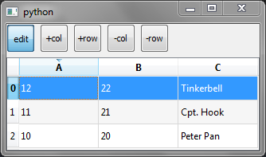
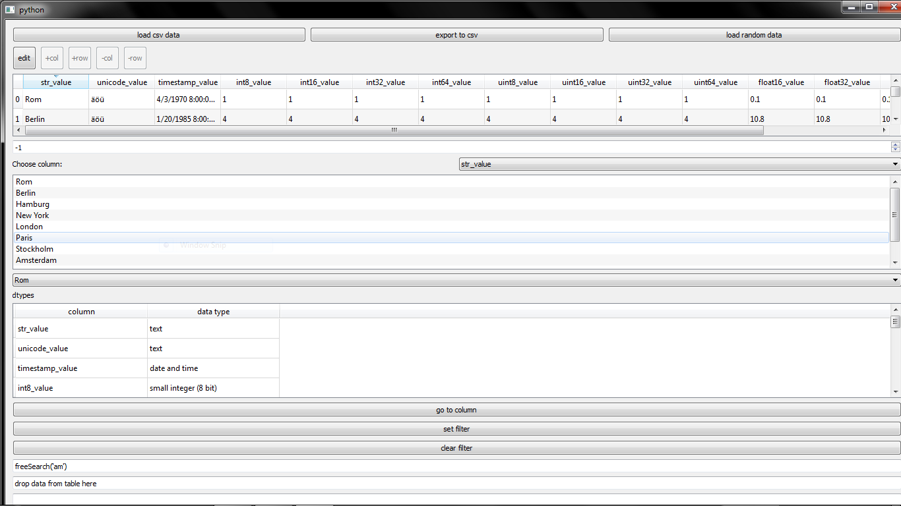

# QtPandas

### Utilities to use pandas (the data analysis/manipulation library for Python) with Qt.

## Project Information

[](https://gitter.im/qtpandas/Lobby#)

## Build Status

[](https://travis-ci.org/draperjames/qtpandas)

Requirements;
> Python 3.x
> PyQt4

## Install 
To install run the following in the command prompt;
```
pip install qtpandas
pip install --upgrade git+https://github.com/robertlugg/easygui.git
```

To use, create a new Python script containing the following:
```
from PyQt4.QtCore import *
from PyQt4.QtGui import *

from qtpandas.views.CSVDialogs import CSVImportDialog

if __name__ == "__main__":
    from sys import argv, exit

    app = QApplication(argv)
    dialog = CSVImportDialog()
    dialog.show()
    app.exec_()
```
# Examples

These can be found in QtPandas/examples.

- BasicExmple.py



- Here is TestApp.py



# Development

## Wanna contribute?
Any feedback is apprecaited.
- Report an issue
- Check out the wiki for development info (coming soon!)
- Fork us.

Forked from @datalyze-solutions's [master](https://github.com/datalyze-solutions/qtpandas).
